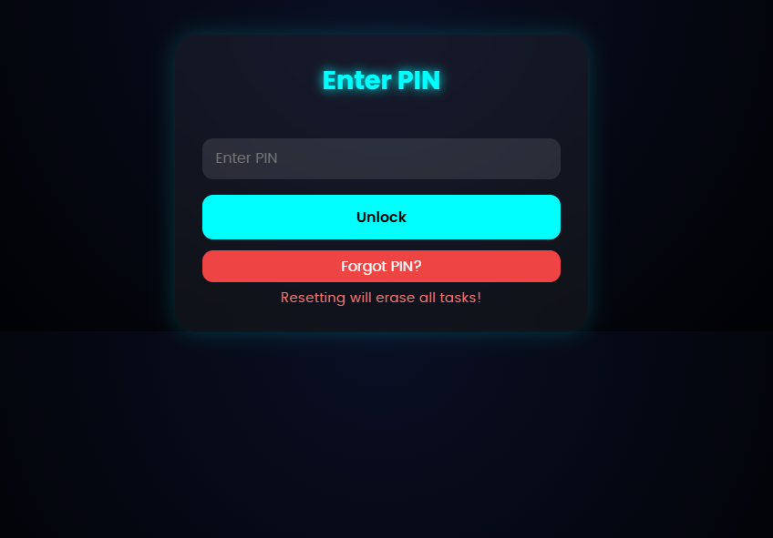
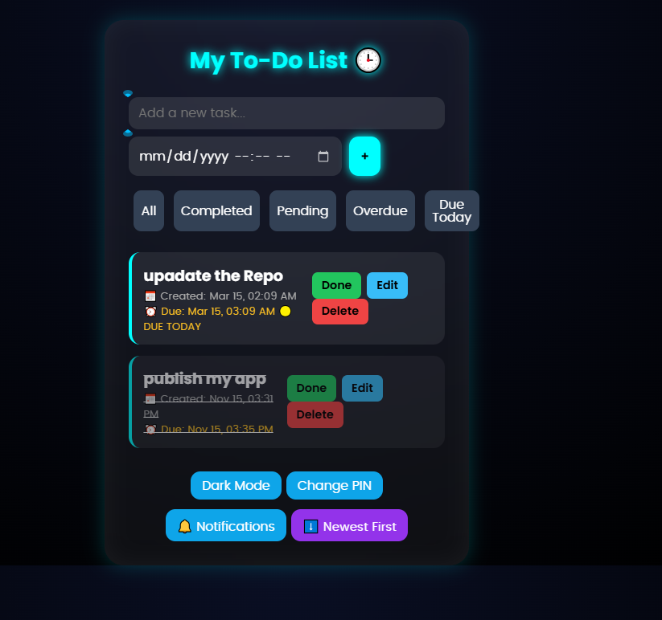

# 📋 PIN-Protected To-Do App

A secure, feature-rich to-do application built with vanilla HTML, CSS, and JavaScript. Manage your tasks with PIN protection, deadline tracking, smart notifications, and more!

###View the liveSite:
https://waithira-felix-coder.github.io/TaskVault/

##Screenshots:



##  Features
### 🔐 Security
- **PIN-Protected Access** - Secure your tasks with a PIN
- **SHA-256 Hashing** - Industry-standard cryptographic security
- **Isolated Data** - Each PIN has its own task list
- **No Backend** - All data stored locally (no server vulnerability)

### 📝 Task Management
- **Create, Edit, Delete Tasks** - Full CRUD functionality
- **Mark as Complete** - Visual strikethrough for completed items
- **Task Timestamps** - See when each task was created
- **Persistent Storage** - Tasks saved automatically with localStorage

### 📅 Deadline Management
- **Due Date Picker** - Set dates and times for tasks
- **Smart Status Indicators** - Visual cues for deadline urgency
  - 🔴 **OVERDUE** - Task past due date
  - 🟡 **DUE TODAY** - Task due today
  - 🟢 **Xd left** - Days remaining until deadline
- **Deadline Filtering** - Quick access to overdue and due-today tasks

### 🎯 Smart Filtering
- **All Tasks** - View everything
- **Completed** - See finished items
- **Pending** - Focus on work to do
- **Overdue** - Find urgent tasks
- **Due Today** - See today's deadlines

### 📊 Organization
- **Sort by Creation Date** - Toggle newest-first or oldest-first
- **Customizable View** - Multiple ways to organize your work
- **Persistent Preferences** - Sort order remembered across sessions

### 🔔 Notifications
- **Browser Notifications** - Get reminded about your tasks
- **Smart Prioritization** - Overdue tasks alerted first
- **Configurable Reminders** - Set interval (1-120 minutes)
- **Selective Alerts** - Choose to notify for all tasks or pending only
- **Works Offline** - Notifications persist even if browser is minimized

### 🌓 UI/UX
- **Neon Dark Theme** - Modern, sleek interface with cyan accents
- **Responsive Design** - Works on desktop, tablet, and mobile
- **Dark Mode Toggle** - Switch theme preference
- **Backdrop Blur Effects** - Glass-morphism design elements
- **Optimized Layout** - All controls fit perfectly in compact card

## 🚀 Quick Start

### Usage
1. **Open the App**
   - Download `index.html` (or `final2.html`)
   - Open in any modern web browser
   - Works offline!

2. **Create PIN**
   - Enter a new PIN on first launch
   - Confirm your PIN
   - Your PIN protects all your data

3. **Add Tasks**
   - Type task name in input field
   - (Optional) Click date field to set deadline
   - Click "+" to add task

4. **Manage Tasks**
   - ✅ Click to mark complete
   - ✏️ Click to edit
   - 🗑️ Click to delete
   - Use filter buttons to organize

5. **Set Notifications**
   - Click 🔔 Notifications button
   - Enable notifications
   - Set reminder interval
   - Choose what to be reminded about
   - Click Save

## 📦 Installation

### For Local Use
```
1. Download index.html
2. Open in web browser
3. Done! No installation needed
```

### For GitHub Pages
```
1. Create GitHub repository "TO-DO-APP"
2. Upload index.html
3. Enable GitHub Pages in Settings
4. Access at: https://yourusername.github.io/TO-DO-APP/
```

### System Requirements
- ✅ Modern web browser (Chrome, Firefox, Safari, Edge)
- ✅ JavaScript enabled
- ✅ localStorage support (all modern browsers)
- ✅ (Optional) Browser notification permission

## 🔒 Security Details

### How Your Data Is Protected
1. **PIN Hashing**
   - Your PIN is converted to SHA-256 hash
   - Only hash is stored, never plaintext
   - Impossible to reverse-engineer PIN from hash

2. **Isolated Storage**
   - Each PIN gets unique storage key
   - Tasks from different PINs never mix
   - No cross-user data leakage

3. **Local Storage**
   - All data stored in browser's localStorage
   - No data sent to servers
   - No third-party access
   - Device-specific (doesn't sync across devices)

### Important Notes
- ⚠️ Device access = data access (localStorage is readable if device is compromised)
- ⚠️ PIN cannot be recovered if forgotten (reset erases all tasks)
- ⚠️ Data doesn't sync across devices (each device has its own copy)
- ✅ Safe for personal use on trusted devices

## 🎮 Keyboard Shortcuts

| Action | Keyboard |
|--------|----------|
| Add Task | Enter (in text input) |
| Focus Task Input | Tab |
| Focus Due Date | Tab |

## 📱 Browser Support

| Browser | Version | Status |
|---------|---------|--------|
| Chrome | 90+ | ✅ Full support |
| Firefox | 88+ | ✅ Full support |
| Safari | 14+ | ✅ Full support |
| Edge | 90+ | ✅ Full support |

## 📚 Technology Stack

### Frontend
- **HTML5** - Semantic structure
- **CSS3** - Modern styling with flex, gradients, backdrop filters
- **Vanilla JavaScript** - ES6+ features

### Web APIs Used
- **Web Crypto API** - SHA-256 hashing
- **Web Notifications API** - Desktop notifications
- **localStorage API** - Persistent data storage
- **Date & Time APIs** - Task timestamps and deadlines

### No Dependencies
- ✅ 0 external libraries
- ✅ 0 frameworks
- ✅ Single HTML file (~450 lines)
- ✅ Works offline

## 📖 Documentation

For detailed development history, technical decisions, and implementation details, see:
- **[DEVELOPMENT_LOG.md](./DEVELOPMENT_LOG.md)** - Complete development journey with all phases, features, and lessons learned

## 🗂️ File Structure

```
TO-DO-APP/
├── index.html                 # Main application file
├── final2.html                # Alternative filename (same content)
├── README.md                  # This file
└── DEVELOPMENT_LOG.md         # Full development documentation
```

## 💾 Data Storage

### localStorage Keys
- `userPIN` - Your PIN hash
- `tasks_<hash>` - Your tasks (JSON array)
- `sortNewestFirst` - Sort preference
- `notifEnabled` - Notification status
- `notifInterval` - Reminder interval
- `notifFilter` - Notification filter

All data stays on your device. No cloud sync.

## 🎨 Features in Detail

### Task Data Structure
```javascript
{
  text: "Buy groceries",           // Task description
  completed: false,                // Done? (true/false)
  createdAt: 1731648300000,       // When created (timestamp)
  dueDate: 1731734700000          // When due (timestamp, optional)
}
```

### Notification Priority
Notifications show tasks in this order:
1. 🔴 Overdue tasks (highest priority)
2. 🟡 Due today tasks (medium priority)
3. 🟢 Other pending tasks (lower priority)

Shows up to 3 tasks per notification, displays count of remaining.

### Filter Logic
- **All** - Every task you've created
- **Completed** - Tasks marked done
- **Pending** - Incomplete tasks
- **Overdue** - Due date passed, not completed
- **Due Today** - Due date is today

## 🔄 Common Tasks

### Change Your PIN
1. Click "Change PIN" button
2. Enter current PIN
3. Enter new PIN
4. Confirm - all tasks preserved!

### Reset PIN (Emergency)
1. Click "Forgot PIN?" on login
2. Confirm data will be erased
3. Create new PIN
4. All previous tasks are cleared

### Export Your Tasks
Currently not built-in. To backup:
1. Open browser DevTools (F12)
2. Go to Application → localStorage
3. Copy the `tasks_<hash>` value
4. Save to a text file

### Import Previously Exported Tasks
1. If you have the JSON, you can manually paste it back into localStorage via DevTools
2. (Future feature: one-click backup/restore)

## 🤝 Contributing

This is a personal project, but if you have ideas:
1. Fork the repository
2. Make your changes
3. Submit a pull request

## 🚧 Future Enhancements

Planned features for future versions:
- [ ] Edit due dates after task creation
- [ ] Sort tasks by due date
- [ ] Calendar/timeline view
- [ ] Task categories/tags
- [ ] Recurring tasks
- [ ] Task descriptions/notes
- [ ] Priority levels (High/Medium/Low)
- [ ] Subtasks
- [ ] Data export/import with one click
- [ ] Cloud sync (requires backend)
- [ ] Progressive Web App (installable)
- [ ] Multiple task lists

## 📝 License

This project is free to use, modify, and distribute.

## ❓ FAQ

**Q: Is my data safe?**
A: Your data never leaves your device. It's stored locally with your PIN hash protecting it.

**Q: Can I sync across devices?**
A: Not currently. Each device has its own copy. Cloud sync would require a backend server.

**Q: What if I forget my PIN?**
A: You can reset it, but all tasks will be erased. That's why it's secure!

**Q: Can I use this offline?**
A: Yes! Works fully offline after first load.

**Q: Can I edit a task's due date?**
A: Currently, you need to delete and re-add with new date. Editing due dates is a planned feature.

**Q: Why no app store?**
A: It's a web app! Just bookmark it or install as PWA (coming soon).

## 🐛 Troubleshooting

**Notifications not showing?**
- Check browser notification permissions
- Click "Allow" when browser asks
- Ensure notifications are enabled in app settings

**Tasks disappeared?**
- Check if you unlocked with different PIN
- Each PIN has separate task list
- If using reset, tasks are intentionally erased

**Date picker not working?**
- Use datetime-local input (browser-native)
- Some older browsers may have limited support
- Use modern browser for best compatibility

**localStorage errors?**
- Clear browser cache: Settings → Privacy → Clear Browsing Data
- Try different browser
- Ensure storage is not full on device

## 📞 Support

For issues or questions:
1. Check [DEVELOPMENT_LOG.md](./DEVELOPMENT_LOG.md) for technical details
2. Review this README for common questions
3. Check browser console (F12) for error messages

## 🎉 Enjoy Your To-Do App!

Stay organized, never miss a deadline, and accomplish your goals!

---


